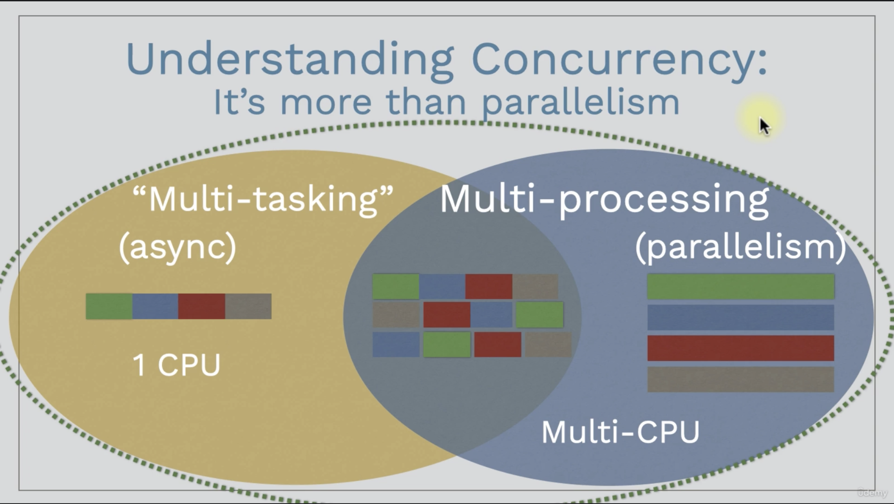
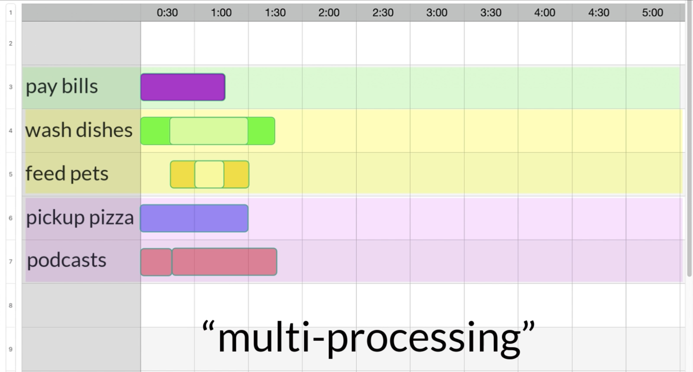

# Summary of Up and Running with Concurrency in Go (Golang)

## What is concurrency Golang?

Concurrency in Golang is the ability for functions to run independent of each other. A goroutine is a function that is capable of running concurrently with other functions.

## Why Learn Concurrency in Golang?
- SPEED and SCABILITY / Improved performance (10x Improvement potential)
- Trends of increased latency and multicore CPUs create both a NEED FOR and an OPPORTUNiTY FOR CONCURRANCY
- It's what Go was designed for. Perhaps its greates feature

## Understanding concurrency - trends, benefits and challenges
Concurrency is an ability of a program to do multiple things at the same time. This means a program that have two or more tasks that run individually of each other, at about the same time, but remain part of the same program. Concurrency is very important in modern software, due to the need to execute independent pieces of code as fast as possible without disturbing the overall flow of the program.

## Latency

## Multiple CPU cores

## Goroutine
The process to be executed as a goroutine must be wrapped into a function. At the time of calling the function, the keyword `go` is added in front of it, with that a new goroutine will be created with the task of running the processes that are in the function.

